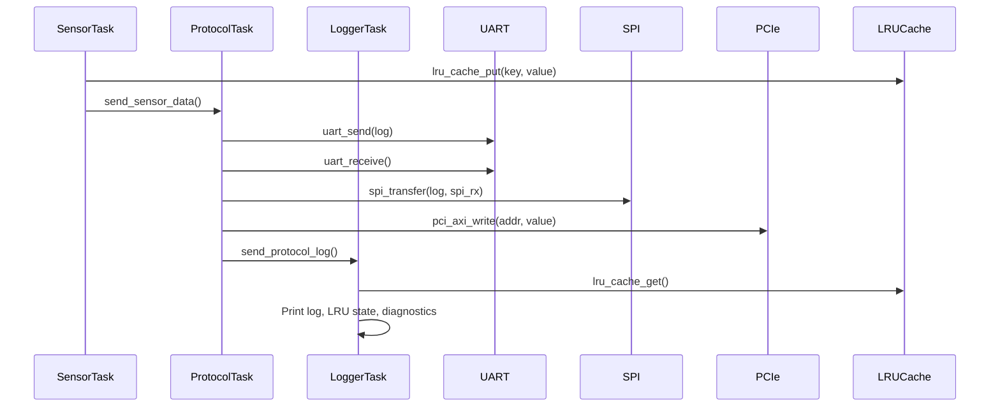
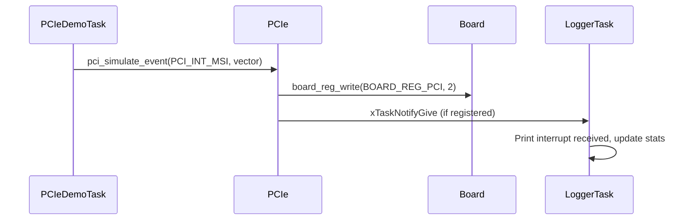
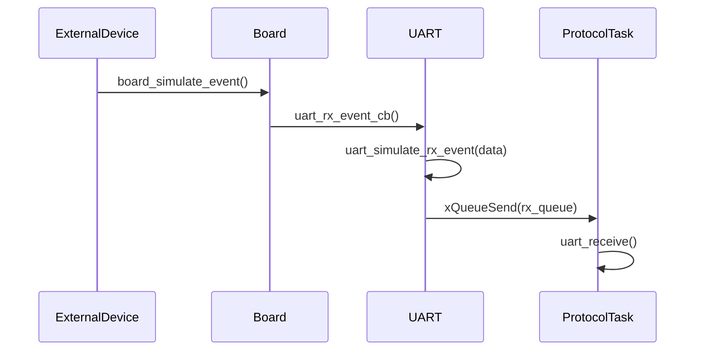

# EmbeddedRTOSSimulator: Detailed Documentation

## Overview

EmbeddedRTOSSimulator is a professional-grade, FreeRTOS-based embedded system simulator designed for ARMv8A (e.g., Raspberry Pi 4) and PC/Posix platforms. It demonstrates advanced RTOS task management, protocol emulation (UART, SPI, PCIe), inter-task communication, LRU caching, and real-time diagnostics. The project is modular, extensible, and ready for both simulation and real hardware integration.

---

## Table of Contents
- [Project Structure](#project-structure)
- [Narrative Feature Overview](#narrative-feature-overview)
- [API-Style Module Reference](#api-style-module-reference)
- [Diagnostics & Monitoring](#diagnostics--monitoring)
- [Build, Run, and Test](#build-run-and-test)
- [Extensibility](#extensibility)
- [File Summary Table](#file-summary-table)

---

## Project Structure

```
Demo/EmbeddedRTOSSimulator/
  main.c
  board.c/h
  uart.c/h
  spi.c/h
  pci.c/h
  task_scheduler.c/h
  lru_cache.c/h
  FreeRTOSConfig.h
  Makefile
  .gitignore
  README.md
  DETAILED_DOC.md
  test_embeddedrtossim.sh
  udp_stats_receiver.py
  sim_stats.log (generated)
  udp_stats_log.csv (generated)
```

---

## Narrative Feature Overview

- **RTOS Task Management:**
  - Multiple tasks (Sensor, Protocol, Logger, PCIe RC/EP) with ARMv8A-style priorities and stack sizes.
  - All tasks communicate via FreeRTOS queues, semaphores, and event groups.

- **Protocol Emulation:**
  - UART and SPI modules simulate real hardware, with ring buffers and FreeRTOS queue integration.
  - PCIe module simulates Gen-7 features: RC/EP, ATU, BAR, config space, MSI/MSIX, interrupts, and event notification.

- **LRU Cache:**
  - Fixed-size, efficient cache for sensor data, demonstrating embedded caching techniques.

- **Diagnostics & Monitoring:**
  - Logger task prints and exports task stats, heap/queue/semaphore/event group state, stack high water marks.
  - Periodic warnings for low heap/stack.
  - Exports stats to file and via UDP for remote visualization.

- **Platform & Hardware Integration:**
  - Native and cross-compile for Pi 4 (32/64-bit), with device path and CFLAGS guidance.
  - Example code for real UART/SPI/PCIe hardware integration.

- **Remote Monitoring & Visualization:**
  - Python UDP receiver script for live stats and CSV export.
  - Ready for integration with dashboards (Grafana, InfluxDB, etc).

- **CI/CD & Automation:**
  - GitHub Actions workflow example for automated build/test.
  - Test script for automated build/run/log validation.

---

## Sequence Diagram: Sensor-to-Logger Data Flow



---

## Sequence Diagram: PCIe Interrupt Flow



---

## Sequence Diagram: UART RX Interrupt Flow



---

## API-Style Module Reference

### main.c
- **Purpose:** Entry point, RTOS setup, all task logic, diagnostics, and hooks.
- **Key APIs:**

```c
/**
 * @brief Main entry point. Initializes all modules and tasks, starts scheduler.
 */
int main(void);

/**
 * @brief Sensor task. Generates sensor data, updates LRU cache, sends to protocol.
 */
void vSensorTask(void *pvParameters);

/**
 * @brief Protocol task. Receives sensor data, handles UART/SPI/PCIe, logs to logger.
 */
void vProtocolTask(void *pvParameters);

/**
 * @brief Logger task. Receives logs, prints, shows LRU cache, diagnostics, exports stats.
 */
void vLoggerTask(void *pvParameters);

/**
 * @brief PCIe demo task. Initializes as RC/EP, simulates interrupts.
 */
void vPCIeDemoTask(void *pvParameters);

/**
 * @brief FreeRTOS stack overflow hook. Prints error and halts.
 */
void vApplicationStackOverflowHook(TaskHandle_t xTask, char *pcTaskName);

/**
 * @brief FreeRTOS malloc failed hook. Prints error and halts.
 */
void vApplicationMallocFailedHook(void);
```

### board.c/h
- **Purpose:** Virtual board abstraction, memory-mapped register simulation, event/interrupt hooks.
- **Key APIs:**
```c
/**
 * @brief Initialize the virtual board and register state.
 */
void board_init(void);

/**
 * @brief Read from a simulated memory-mapped register.
 */
uint32_t board_reg_read(uint32_t addr);

/**
 * @brief Write to a simulated memory-mapped register.
 */
void board_reg_write(uint32_t addr, uint32_t value);

/**
 * @brief Register an event/interrupt callback.
 */
void board_register_event(board_event_cb_t cb, void *context);
```

### uart.c/h
- **Purpose:** UART protocol emulation, ring buffers, FreeRTOS queue integration.
- **Key APIs:**
```c
/**
 * @brief Initialize UART emulation and RX queue.
 */
void uart_init(void);

/**
 * @brief Send data over UART (emulated).
 */
void uart_send(const char *data);

/**
 * @brief Receive data from UART (emulated).
 */
void uart_receive(char *buffer, int maxlen);

/**
 * @brief Simulate a UART RX event (inject data).
 */
void uart_simulate_rx_event(const char *data);
```

### spi.c/h
- **Purpose:** SPI protocol emulation, master/slave, FreeRTOS queue integration.
- **Key APIs:**
```c
/**
 * @brief Initialize SPI emulation in master or slave mode.
 */
void spi_init(spi_mode_t mode);

/**
 * @brief Transfer data over SPI (emulated).
 */
void spi_transfer(const char *tx, char *rx, int len);

/**
 * @brief Simulate an SPI RX event (inject data).
 */
void spi_simulate_rx_event(const char *data);
```

### pci.c/h
- **Purpose:** PCIe Gen-7 emulation, RC/EP, ATU, BAR, config space, MSI/MSIX, interrupts, event notification.
- **Key APIs:**
```c
/**
 * @brief Initialize PCIe as RC or EP, with speed and lane width.
 */
void pci_init(pci_dev_type_t type, pci_link_speed_t speed, pci_lane_width_t width);

/**
 * @brief Configure an ATU region.
 */
void pci_atu_configure(int region, atu_type_t type, uint32_t base, uint32_t limit, uint32_t target);

/**
 * @brief Generate a PCIe interrupt (MSI/MSIX/legacy).
 */
void pci_generate_interrupt(pci_int_type_t type, int vector);

/**
 * @brief Register a task for a specific interrupt type/vector.
 */
void pci_interrupt_register(pci_int_type_t type, int vector, TaskHandle_t task);

/**
 * @brief Simulate a PCIe event (e.g., MSI, MSIX).
 */
void pci_simulate_event(pci_int_type_t type, int vector);
```

### task_scheduler.c/h
- **Purpose:** Task priorities, FreeRTOS queues, semaphores, event groups, inter-task comms API.
- **Key APIs:**
```c
/**
 * @brief Initialize all queues, semaphores, and event groups.
 */
void task_scheduler_init(void);

/**
 * @brief Send/receive sensor data between tasks.
 */
BaseType_t send_sensor_data(const void *data, TickType_t timeout);
BaseType_t recv_sensor_data(void *data, TickType_t timeout);

/**
 * @brief Send/receive protocol logs between tasks.
 */
BaseType_t send_protocol_log(const void *data, TickType_t timeout);
BaseType_t recv_protocol_log(void *data, TickType_t timeout);

/**
 * @brief Signal and wait for PCIe events.
 */
void signal_pcie_event(void);
void wait_for_pcie_event(void);
```

### lru_cache.c/h
- **Purpose:** Embedded-suitable LRU cache for sensor data.
- **Key APIs:**
```c
/**
 * @brief Initialize the LRU cache.
 */
void lru_cache_init(void);

/**
 * @brief Insert or update a key/value in the cache.
 */
void lru_cache_put(int key, int value);

/**
 * @brief Retrieve a value by key from the cache.
 * @param found Set to 1 if found, 0 if not.
 */
int lru_cache_get(int key, int *found);

/**
 * @brief Clear the cache.
 */
void lru_cache_clear(void);

/**
 * @brief Get the number of valid entries in the cache.
 */
size_t lru_cache_count(void);
```

### FreeRTOSConfig.h
- **Purpose:** Advanced stack/heap config, overflow/malloc hooks, runtime stats.
- **Key Settings:**
  - `configCHECK_FOR_STACK_OVERFLOW`, `configUSE_MALLOC_FAILED_HOOK`, `configGENERATE_RUN_TIME_STATS`, `configTOTAL_HEAP_SIZE`, `configMINIMAL_STACK_SIZE`

### test_embeddedrtossim.sh
- **Purpose:** Automated build/run/test script, output validation.

### udp_stats_receiver.py
- **Purpose:** Python UDP receiver for remote stats, CSV export, live monitoring.

### Makefile
- **Purpose:** Build system for native/cross, all kernel objects included.

### .gitignore
- **Purpose:** Ignore build/test artifacts.

### README.md
- **Purpose:** User-facing documentation, usage, platform, CI/CD, diagnostics, visualization.

### DETAILED_DOC.md
- **Purpose:** (This file) Full technical and API documentation for maintainers and advanced users.

---

## Diagnostics & Monitoring

- **Logger task** prints and exports every 10 seconds:
  - FreeRTOS task stats (`vTaskList`)
  - Heap usage (`xPortGetFreeHeapSize`)
  - Queue stats (`uxQueueMessagesWaiting`)
  - Semaphore count (`uxSemaphoreGetCount`)
  - Event group bits (`xEventGroupGetBits`)
  - Per-task stack high water marks (`uxTaskGetSystemState`)
  - Warnings for low heap/stack
  - Exports to `sim_stats.log` and via UDP for remote dashboards
- **Python UDP receiver** logs stats to CSV for visualization

---

## Build, Run, and Test

- See `README.md` for full instructions.
- Native and cross-compile for Pi 4 (32/64-bit) supported.
- Automated test script and CI/CD workflow included.

---

## Extensibility

- Add new tasks, protocols, or hardware drivers by extending the respective modules.
- Integrate with real hardware by replacing emulation code in `uart.c`, `spi.c`, or `pci.c`.
- Add new diagnostics or export formats as needed.

---

## Structs & Typedefs Reference

### board.h
```c
/**
 * @brief Simulated board state (memory-mapped registers).
 */
struct board_state {
    uint32_t uart_reg;
    uint32_t spi_reg;
    uint32_t pci_reg;
    uint32_t sensor_reg;
};
```

### uart.h
```c
/**
 * @brief UART emulation state (ring buffers, FreeRTOS queue).
 */
struct uart_state {
    char tx_buffer[UART_TX_BUFFER_SIZE];
    size_t tx_head, tx_tail;
    char rx_buffer[UART_RX_BUFFER_SIZE];
    size_t rx_head, rx_tail;
    QueueHandle_t rx_queue;
};
```

### spi.h
```c
/**
 * @brief SPI emulation state (ring buffers, FreeRTOS queue, mode).
 */
struct spi_state {
    spi_mode_t mode;
    char tx_buffer[SPI_BUFFER_SIZE];
    size_t tx_head, tx_tail;
    char rx_buffer[SPI_BUFFER_SIZE];
    size_t rx_head, rx_tail;
    QueueHandle_t rx_queue;
};
```

### pci.h
```c
/**
 * @brief PCIe state (config space, BARs, ATU, MSI/MSIX, interrupts, etc).
 */
struct pci_state {
    pci_dev_type_t dev_type;
    pci_link_speed_t link_speed;
    pci_lane_width_t lane_width;
    uint32_t config_space[64];
    uint32_t bar[PCI_NUM_BARS];
    uint32_t bar_mask[PCI_NUM_BARS];
    struct atu_region atu[PCI_NUM_ATU_REGIONS];
    uint32_t link_up;
    uint32_t pll_locked;
    uint32_t perst_deasserted;
    uint32_t fw_loaded;
    uint32_t cr_para_written;
    uint32_t ltssm_state;
    pci_int_type_t int_type;
    struct pcie_capability caps[PCI_NUM_CAPS];
    struct msi_vector msi[PCI_NUM_MSI_VECTORS];
    struct msix_vector msix[PCI_NUM_MSIX_VECTORS];
    struct pci_int_task_entry int_tasks[PCI_NUM_INT_TASKS];
    QueueHandle_t event_queue;
};

/**
 * @brief PCIe ATU region configuration.
 */
struct atu_region {
    atu_type_t type;
    uint32_t base;
    uint32_t limit;
    uint32_t target;
};

/**
 * @brief PCIe capability structure (for config space).
 */
struct pcie_capability {
    uint8_t cap_id;
    uint8_t next_ptr;
    uint8_t data[14];
};

/**
 * @brief MSI/MSIX vector entry.
 */
struct msi_vector {
    uint8_t enabled;
    uint8_t masked;
    TaskHandle_t task;
};
struct msix_vector {
    uint8_t enabled;
    uint8_t masked;
    TaskHandle_t task;
};

/**
 * @brief Interrupt registration entry.
 */
struct pci_int_task_entry {
    pci_int_type_t type;
    int vector;
    TaskHandle_t task;
};
```

### task_scheduler.c/h
```c
/**
 * @brief Sensor data message (sent from SensorTask to ProtocolTask).
 */
typedef struct {
    int sensor_value;
    uint32_t timestamp;
} sensor_msg_t;

/**
 * @brief Protocol log message (sent from ProtocolTask to LoggerTask).
 */
typedef struct {
    char log[64];
} protocol_log_t;
```

### lru_cache.h
```c
/**
 * @brief LRU cache entry.
 */
typedef struct {
    int key;
    int value;
    uint32_t last_used;
} lru_entry_t;

/**
 * @brief LRU cache state.
 */
typedef struct {
    lru_entry_t entries[LRU_CACHE_SIZE];
    uint32_t use_counter;
} lru_cache_t;
```

---

## Enums Reference

### pci.h
```c
/**
 * @brief PCIe device type (Root Complex or Endpoint).
 */
typedef enum {
    PCI_TYPE_RC = 0, // Root Complex
    PCI_TYPE_EP = 1  // Endpoint
} pci_dev_type_t;

/**
 * @brief PCIe link speed (Gen1-Gen7).
 */
typedef enum {
    PCI_GEN1 = 1,
    PCI_GEN2,
    PCI_GEN3,
    PCI_GEN4,
    PCI_GEN5,
    PCI_GEN6,
    PCI_GEN7
} pci_link_speed_t;

/**
 * @brief PCIe lane width (x1, x2, ... x32).
 */
typedef enum {
    PCI_LANES_X1 = 1,
    PCI_LANES_X2 = 2,
    PCI_LANES_X4 = 4,
    PCI_LANES_X8 = 8,
    PCI_LANES_X16 = 16,
    PCI_LANES_X32 = 32
} pci_lane_width_t;

/**
 * @brief ATU region type (inbound or outbound).
 */
typedef enum {
    ATU_TYPE_INBOUND = 0,
    ATU_TYPE_OUTBOUND = 1
} atu_type_t;

/**
 * @brief PCIe interrupt type (legacy, MSI, MSIX, INTC).
 */
typedef enum {
    PCI_INT_NONE = 0,
    PCI_INT_LEGACY,
    PCI_INT_MSI,
    PCI_INT_MSIX,
    PCI_INT_INTC
} pci_int_type_t;
```

### spi.h
```c
/**
 * @brief SPI mode (master or slave).
 */
typedef enum {
    SPI_MODE_MASTER = 0,
    SPI_MODE_SLAVE = 1
} spi_mode_t;
```

---

## Error Codes & Warnings

| Error/Warning                | Description                                      | Action Taken                |
|-----------------------------|--------------------------------------------------|-----------------------------|
| Stack overflow (hook)        | Task stack overflow detected                     | Print error, halt system    |
| Malloc failed (hook)         | Out of heap memory                               | Print error, halt system    |
| [WARN] FreeRTOS heap low     | Heap < 2KB at runtime                            | Print warning, continue     |
| [WARN] Stack low for task    | Task stack min free < 128 bytes                  | Print warning, continue     |
| Parse error (UDP receiver)   | Malformed UDP stats packet                       | Print warning, skip packet  |

---

## File Summary Table

| File                    | Purpose/Content                                                                 |
|-------------------------|---------------------------------------------------------------------------------|
| main.c                  | RTOS setup, all task logic, diagnostics, hooks                                  |
| board.c/h               | Virtual board, register/event simulation                                        |
| uart.c/h                | UART emulation, FreeRTOS queue integration                                      |
| spi.c/h                 | SPI emulation, FreeRTOS queue integration                                       |
| pci.c/h                 | PCIe Gen-7 emulation, ATU, BAR, MSI/MSIX, interrupts, advanced features         |
| task_scheduler.c/h      | Task priorities, queues, semaphores, event groups, comms API                    |
| lru_cache.c/h           | Embedded-suitable LRU cache for sensor data                                     |
| FreeRTOSConfig.h        | Advanced stack/heap config, hooks, runtime stats                                |
| Makefile                | Build system, native/cross, all kernel objects                                  |
| .gitignore              | Ignore build/test artifacts                                                     |
| README.md               | Full documentation, usage, platform, CI/CD, diagnostics, visualization          |
| DETAILED_DOC.md         | (This file) Full technical and API documentation                                |
| test_embeddedrtossim.sh | Automated build/run/test script                                                 |
| udp_stats_receiver.py   | Python UDP receiver for remote stats, CSV export                                |

---

## Contact & Contribution

For questions, contributions, or advanced integration, see the project README or open an issue/pull request.