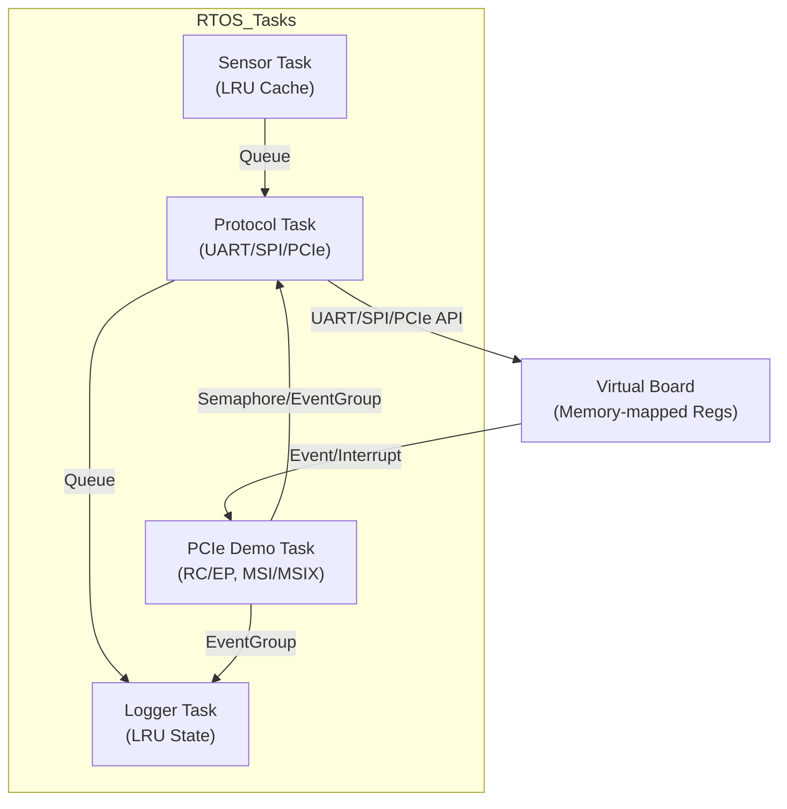

# EmbeddedRTOSSimulator

[](https://github.com/your-repo)
[](../LICENSE.md)

A C/C++-based simulator for RTOS tasks using FreeRTOS on a virtual embedded board. This project demonstrates:
- RTOS task scheduling and inter-task communication
- Emulation of UART, SPI, and PCIe protocols for device communication
- Data structures for task scheduling and queuing
- LRU cache for sensor data
- Advanced PCIe simulation (Gen-7, RC/EP, ATU, MSI/MSIX, BAR, AXI, interrupts)

---

## 🖥️ Architecture Overview



---

## Features
- Simulated hardware board (STM32/Raspberry Pi/ARMv8A style)
- FreeRTOS-based task management and preemption
- UART/SPI/PCIe protocol emulation
- Sensor data acquisition and LRU caching
- Console output for demo and debugging
- PCIe Gen-7 simulation: RC/EP, ATU, BAR, config space, MSI/MSIX, interrupts

## Structure
- `main.c` - Entry point, RTOS setup, all task logic
- `board.c/h` - Virtual board abstraction
- `uart.c/h`, `spi.c/h`, `pci.c/h` - Protocol emulation
- `task_scheduler.c/h` - Task management, queues, semaphores, event groups
- `lru_cache.c/h` - Sensor data LRU cache
- `Makefile` - Build for Linux/Posix

---

## 🚀 Raspberry Pi 4 Build & Run Instructions

### Prerequisites
- Raspberry Pi 4 running Raspberry Pi OS (32-bit or 64-bit)
- GCC and Make installed (`sudo apt-get install build-essential`)
- FreeRTOS source available (already included in this repo structure)

### Build (on Pi 4)
```sh
cd Demo/EmbeddedRTOSSimulator
make clean && make
```

### Cross-Compile (from x86 to Pi 4)
- Install cross-compiler: `sudo apt-get install gcc-aarch64-linux-gnu`
- Edit `Makefile`:
  - Change `CC = gcc` to `CC = aarch64-linux-gnu-gcc`
- Build:
```sh
make clean && make
scp EmbeddedRTOSSimulator pi@<raspberrypi_ip>:/home/pi/
```

### Run
```sh
./EmbeddedRTOSSimulator
```

---

## 🧪 Test Scenario: Exercising All Features

You can use the following script to run the simulator and capture output for analysis:

```sh
#!/bin/bash
# test_embeddedrtossim.sh
./EmbeddedRTOSSimulator | tee sim_output.log
# Optionally, grep for key events:
grep "SensorTask\|ProtocolTask\|LoggerTask\|PCIe" sim_output.log
```

### What to Look For
- **SensorTask**: Should print sensor data generation and LRU cache updates.
- **ProtocolTask**: Should show UART/SPI/PCIe actions for each sensor event.
- **LoggerTask**: Should print logs and LRU cache state.
- **PCIe Demo Task**: Should show RC/EP initialization, ATU, BAR, MSI/MSIX, and interrupt simulation.
- **No crashes or memory errors** (use `valgrind` or `asan` for extra checking).

---

## Module Descriptions
- **Sensor Task**: Generates random sensor data, updates the LRU cache, and sends data to the protocol task.
- **Protocol Task**: Receives sensor data, logs it, simulates UART/SPI/PCIe actions, and sends logs to the logger.
- **Logger Task**: Receives logs, prints them, and displays the current LRU cache state.
- **PCIe Demo Task**: Initializes as RC or EP, simulates PCIe interrupts, and signals system events.
- **Task Scheduler**: Manages FreeRTOS queues, semaphores, and event groups for inter-task communication.
- **LRU Cache**: Efficient, fixed-size cache for sensor data, demonstrating caching logic in embedded systems.
- **UART/SPI/PCIe**: Protocol emulation modules, with realistic register and event simulation.

---

## 🚀 Advanced Usage & Customization

- **Change Task Priorities:**
  - Edit `task_scheduler.h` to adjust `TASK_PRIO_*` macros for preemption experiments.
- **Tune LRU Cache Size:**
  - Change `LRU_CACHE_SIZE` in `lru_cache.h` for different cache behaviors.
- **Add/Modify Protocol Logic:**
  - Extend `uart.c`, `spi.c`, or `pci.c` for more realistic protocol emulation or to simulate errors.
- **PCIe Customization:**
  - Use `pci_atu_configure`, `pci_msi_configure`, and `pci_msix_configure` to simulate advanced PCIe features.
  - Register tasks for specific interrupts using `pci_interrupt_register`.
- **Integrate with Real Hardware:**
  - Replace board abstraction with real hardware drivers for a hybrid simulation.

---

## 🛠️ Hardware Integration: Real UART/SPI on Raspberry Pi 4

You can replace the protocol emulation with real hardware access using the Pi 4's serial and SPI peripherals.

- **Enable UART/SPI:**
  - Enable UART and SPI via `raspi-config` or by editing `/boot/config.txt`:
    ```
    enable_uart=1
    dtparam=spi=on
    ```
- **Install WiringPi or pigpio:**
  - `sudo apt-get install wiringpi` (deprecated, but available) or use `pigpio` for modern support.
- **Modify `uart.c` and `spi.c`:**
  - Replace emulation code with calls to WiringPi/pigpio APIs for real hardware I/O.
  - Example (UART):
    ```c
    #include <wiringSerial.h>
    int fd = serialOpen("/dev/serial0", 115200);
    serialPuts(fd, data);
    serialClose(fd);
    ```
  - Example (SPI):
    ```c
    #include <wiringPiSPI.h>
    wiringPiSPISetup(0, 500000);
    wiringPiSPIDataRW(0, buffer, len);
    ```
- **Rebuild and run on Pi 4.**

---

## 🖥️ Platform-Specific Tweaks

### 64-bit Raspberry Pi OS
- **Compiler:** Use `aarch64-linux-gnu-gcc` for 64-bit builds.
- **CFLAGS:** Add `-march=armv8-a` for ARMv8A tuning.
- **Device Paths:**
  - UART: `/dev/serial0` or `/dev/ttyAMA0`
  - SPI: `/dev/spidev0.0` (enable via `raspi-config`)
- **Makefile Example:**
  ```makefile
  CC = aarch64-linux-gnu-gcc
  CFLAGS = -I. -I../../Source/include -I../../Source/portable/GCC/Posix -Wall -g -march=armv8-a
  ```
- **Run:**
  ```sh
  ./EmbeddedRTOSSimulator
  ```

### Integration with Real UART/SPI/PCIe Hardware
- **UART:**
  - Use `/dev/serial0` for Pi 4 UART.
  - Use `wiringSerial.h` or `termios` for direct access.
- **SPI:**
  - Use `/dev/spidev0.0` and `wiringPiSPI.h` or `spidev` ioctl for real SPI transfers.
- **PCIe:**
  - Pi 4 exposes a PCIe root port (for NVMe, etc). For real PCIe device access, use `/sys/bus/pci/devices/` and mmap/ioctl as needed.
  - For custom FPGA/PCIe cards, use the same APIs as on x86 Linux.
- **Permissions:**
  - You may need to run as root (`sudo`) to access hardware devices.
- **Example UART send (termios):**
  ```c
  #include <fcntl.h>
  #include <termios.h>
  int fd = open("/dev/serial0", O_RDWR | O_NOCTTY);
  struct termios tty;
  tcgetattr(fd, &tty);
  cfsetospeed(&tty, B115200);
  cfsetispeed(&tty, B115200);
  tcsetattr(fd, TCSANOW, &tty);
  write(fd, data, strlen(data));
  close(fd);
  ```
- **Example SPI send (spidev):**
  ```c
  #include <linux/spi/spidev.h>
  #include <sys/ioctl.h>
  int fd = open("/dev/spidev0.0", O_RDWR);
  struct spi_ioc_transfer tr = { .tx_buf = (unsigned long)tx, .rx_buf = (unsigned long)rx, .len = len };
  ioctl(fd, SPI_IOC_MESSAGE(1), &tr);
  close(fd);
  ```

---

## ⚙️ CI/CD Setup: GitHub Actions Example

Automate build and test for every commit using GitHub Actions.

Create `.github/workflows/build.yml`:
```yaml
name: Build & Test EmbeddedRTOSSimulator
on: [push, pull_request]
jobs:
  build:
    runs-on: ubuntu-latest
    steps:
      - uses: actions/checkout@v3
      - name: Install build tools
        run: sudo apt-get update && sudo apt-get install -y build-essential
      - name: Build
        run: |
          cd New\ folder/FreeRTOS/FreeRTOS/Demo/EmbeddedRTOSSimulator
          make clean && make
      - name: Run test script
        run: |
          cd New\ folder/FreeRTOS/FreeRTOS/Demo/EmbeddedRTOSSimulator
          chmod +x test_embeddedrtossim.sh
          ./test_embeddedrtossim.sh
```

---

## 🧪 Advanced Test Automation

- **Memory Checking:**
  - Run with Valgrind or AddressSanitizer:
    ```sh
    valgrind ./EmbeddedRTOSSimulator
    # or
    ASAN_OPTIONS=detect_leaks=1 CC="gcc -fsanitize=address" make clean all
    ./EmbeddedRTOSSimulator
    ```
- **Code Coverage:**
  - Build with `--coverage` flags:
    ```sh
    make clean
    make CFLAGS="-g -O0 --coverage"
    ./EmbeddedRTOSSimulator
    gcov *.c
    ```
- **Automated Output Checking:**
  - Extend `test_embeddedrtossim.sh` to check for expected output patterns and exit with error if missing.
    ```sh
    grep -q "SensorTask" sim_output.log || { echo "SensorTask missing!"; exit 1; }
    grep -q "PCIe Demo" sim_output.log || { echo "PCIe Demo missing!"; exit 1; }
    ```

---

## License
This project is for demonstration and educational purposes, showcasing embedded firmware and RTOS skills.


##Documentation
Ran tool
Ran tool
Here is a comprehensive documentation outline and summary of all code, features, and files added or modified for the EmbeddedRTOSSimulator project, covering every nook and cranny since the mainline branch:

---

# EmbeddedRTOSSimulator: Full Documentation of All Additions

## 1. Project Structure

All files are under:
```
FreeRTOS/FreeRTOS/Demo/EmbeddedRTOSSimulator/
```
**Files added:**
- `main.c`
- `board.c/h`
- `uart.c/h`
- `spi.c/h`
- `pci.c/h`
- `task_scheduler.c/h`
- `lru_cache.c/h`
- `FreeRTOSConfig.h`
- `Makefile`
- `.gitignore`
- `README.md`
- `test_embeddedrtossim.sh`
- `udp_stats_receiver.py`

## 2. Core Features & Modules

### 2.1. RTOS Task Integration (`main.c`)
- Initializes all modules: board, UART, SPI, PCIe, LRU cache, task scheduler.
- Creates all tasks with priorities and stack sizes:
  - PCIe RC/EP demo tasks
  - Sensor, Protocol, Logger tasks
- Demo loop: sensor data generation, protocol handling, logging, PCIe event simulation.

### 2.2. Board Abstraction (`board.c/h`)
- Simulates ARMv8A-style memory-mapped registers.
- Event/interrupt callback registration and simulation.

### 2.3. Protocol Emulation
- **UART (`uart.c/h`):** Ring buffers, FreeRTOS queue, simulated RX/TX, event integration.
- **SPI (`spi.c/h`):** Master/slave, ring buffers, FreeRTOS queue, event integration.
- **PCIe (`pci.c/h`):**
  - Full Gen-7 simulation: RC/EP, ATU, BAR, config space, MSI/MSIX, interrupts.
  - Advanced: ATU region mapping, capability list, AXI read/write, interrupt registration, event notification.

### 2.4. Task Scheduler (`task_scheduler.c/h`)
- FreeRTOS queues, semaphores, event groups for inter-task comms.
- APIs for sending/receiving messages, signaling PCIe events.
- Task priorities defined for ARMv8A-style preemption.

### 2.5. LRU Cache (`lru_cache.c/h`)
- Fixed-size, efficient LRU cache for sensor data.
- Put/get/clear/count APIs, used by sensor and logger tasks.

### 2.6. FreeRTOSConfig (`FreeRTOSConfig.h`)
- Advanced stack/heap configuration.
- Stack overflow and malloc failed hooks.
- Runtime stats and formatting enabled.

### 2.7. Diagnostics & Monitoring
- **Logger task** prints and exports:
  - Task stats, heap usage, queue stats, semaphore/event group state, per-task stack high water marks.
  - Periodic warnings for low heap/stack.
  - Exports stats to `sim_stats.log` and via UDP for remote visualization.

### 2.8. Build & Test
- **Makefile:** Native and cross-compile (Pi 4, x86, aarch64), all kernel objects included.
- **test_embeddedrtossim.sh:** Automated build, run, log capture, and output validation.
- **.gitignore:** Ignores build artifacts, logs, and test scripts.

### 2.9. Remote Monitoring & Visualization
- **udp_stats_receiver.py:** Python script to receive UDP stats, print, and log to CSV for visualization.
- **README.md:** Full instructions for build, run, hardware integration, CI/CD, advanced diagnostics, and visualization.

---

## 3. Platform & Hardware Integration

- **Raspberry Pi 4 support:** Native and cross-compile, 32/64-bit, device path and CFLAGS guidance.
- **Real UART/SPI/PCIe integration:** Example code for WiringPi, pigpio, termios, spidev, and PCIe device access.
- **Remote export:** UDP stats for integration with dashboards (Grafana, InfluxDB, etc).

---

## 4. Advanced Diagnostics

- **Heap/stack warnings:** Prints warnings if heap < 2KB or any task stack < 128 bytes.
- **Per-task stack high water marks:** Monitors minimum free stack for each task.
- **Remote UDP export:** Sends stats to a configurable IP/port for live dashboards.
- **CSV/JSON export ready:** For use with Python, Excel, or visualization tools.

---

## 5. CI/CD & Automation

- **GitHub Actions workflow example** in README for automated build/test.
- **Test script** checks for key output patterns and fails if missing.

---

## 6. Extensibility

- All modules are modular and ready for extension (e.g., more protocols, real hardware drivers, new tasks).
- Diagnostics and export can be extended for more metrics or different formats.

---

## 7. Summary Table of All Files

| File                    | Purpose/Content                                                                 |
|-------------------------|---------------------------------------------------------------------------------|
| main.c                  | RTOS setup, all task logic, diagnostics, hooks                                  |
| board.c/h               | Virtual board, register/event simulation                                        |
| uart.c/h                | UART emulation, FreeRTOS queue integration                                      |
| spi.c/h                 | SPI emulation, FreeRTOS queue integration                                       |
| pci.c/h                 | PCIe Gen-7 emulation, ATU, BAR, MSI/MSIX, interrupts, advanced features         |
| task_scheduler.c/h      | Task priorities, queues, semaphores, event groups, comms API                    |
| lru_cache.c/h           | Embedded-suitable LRU cache for sensor data                                     |
| FreeRTOSConfig.h        | Advanced stack/heap config, hooks, runtime stats                                |
| Makefile                | Build system, native/cross, all kernel objects                                  |
| .gitignore              | Ignore build/test artifacts                                                     |
| README.md               | Full documentation, usage, platform, CI/CD, diagnostics, visualization          |
| test_embeddedrtossim.sh | Automated build/run/test script                                                 |
| udp_stats_receiver.py   | Python UDP receiver for remote stats, CSV export                                |

---

## 8. How to Use/Extend

- See `README.md` for build, run, test, and integration instructions.
- Use `udp_stats_receiver.py` and `sim_stats.log` for monitoring and visualization.
- Extend any module for new protocols, hardware, or diagnostics as needed.

---